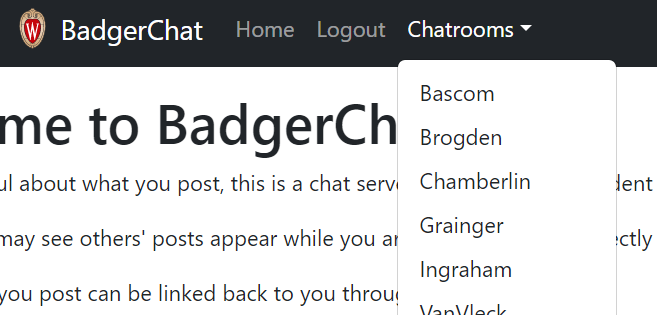
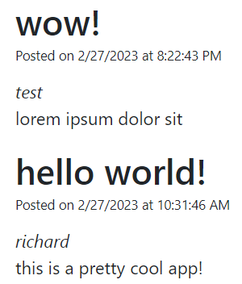
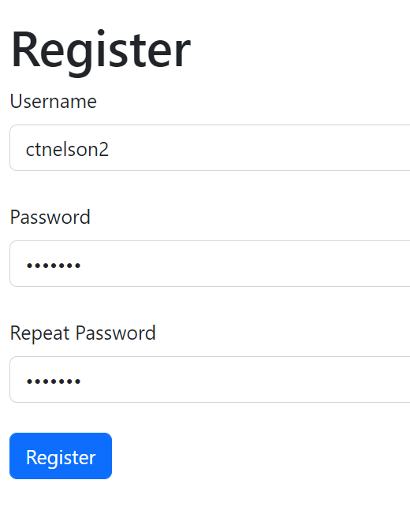
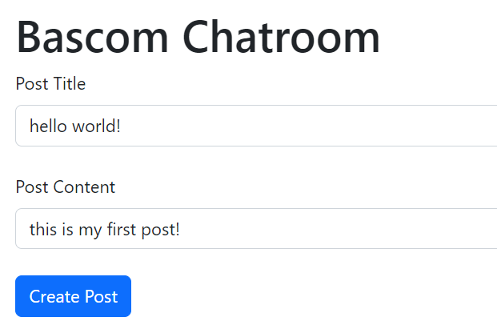
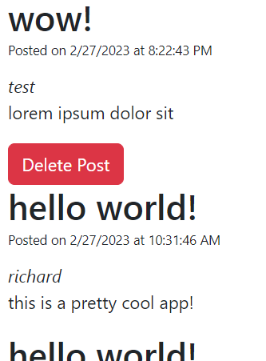

[](https://classroom.github.com/online_ide?assignment_repo_id=10417855&assignment_repo_type=AssignmentRepo)

# CS571-S23 HW06: BadgerChat

Welcome to BadgerChat! For this assignment, you will complete a web application that allows badgers to chat with other badgers via different chatrooms. This assignment works with a *real* API! Please be mindful about what you post, this is a chat server shared by every student in CS571.

**The design aspect to this assignment is read-only. There is no deliverable associated with it.**

## BadgerChat

The starter code provided to you was generated using [create-react-app](https://www.npmjs.com/package/create-react-app). Furthermore, [bootstrap](https://www.npmjs.com/package/bootstrap), [react-bootstrap](https://www.npmjs.com/package/react-bootstrap), and [react-router](https://reactrouter.com/en/main) have already been installed. **You should *not* re-run the create-react-app command**. Instead, in this directory, simply run...

```bash
npm install
npm start
```

Then, in a browser, open `localhost:3000`. You should *not* open index.html in a browser; React works differently than traditional web programming! When you save your changes, they appear in the browser automatically. I recommend using [Visual Studio Code](https://code.visualstudio.com/) to do your development work.

The components you will be working on are located in the `components` folder. Some code has already been done for you, but there is still much work to do.

All data can be retrieved via API calls to `https://www.cs571.org/s23/hw6/api/`. A brief overview of the API is provided below. Please refer to `API_DOCUMENTATION.md` for details.

All routes are relative to `https://www.cs571.org/s23/hw6/api/`

| Method | URL | Purpose | Return Codes |
| --- | --- | --- | --- |
| `GET`| `/chatroom` | Get all chatrooms. | 200, 304 |
| `GET` | `/chatroom/:chatroomName/messages`| Get latest 25 messages for specified chatroom. | 200, 304, 404 |
| `POST` | `/chatroom/:chatroomName/messages` | Posts a message to the specified chatroom. | 200, 400, 404, 413 |
| `DELETE` | `/chatroom/:chatroomName/messages/:messageId` | Deletes the given message. | 200, 400, 401, 404 |
| `POST` | `/register` | Registers a user account. | 200, 400, 401, 409, 413  |
| `POST` | `/login` | Logs a user in. | 200, 400, 401, 404 |
| `POST` | `/logout` | Logs the current user out. | 200 |
| `GET` | `/whoami` | Gets details about the currently logged in user. | 200, 401 |

When making API calls with a request body, don't forget to include the header `"Content-Type": "application/json"`. If the request requires credentials, the fetch should have an option of `credentials: "include"`.

### 1. Display Chatrooms

Some work has already been done for you! In `BadgerApp.js`, insert your `X-CS571-ID` into the fetch for chatrooms. This will create the *routes* for each chatroom, e.g. `chatrooms/Bascom`.

However, you need to *display* navigation links for each route. In `BadgerLayout.js`, create a `NavDropdown.Item` [(docs)](https://react-bootstrap.github.io/components/navs/#using-dropdowns) for each chatroom underneath the "Chatrooms" `NavDropdown`. You can add `as={Link}` to make the dropdown item act as a link.



### 2. Display Badger Messages

In `BadgerChatroom.js`, the logic to retrieve `messages` has already been completed for you. However, again, you will need to insert your `X-CS571-ID`.

Display these messages using the `BadgerMessage` component, which takes four props: `title`, `poster`, `content`, and `created`. Don't forget to specify a unique `key`! If there are no messages in the chatroom, display text stating "There are no messages in this chatroom yet". It is okay for this text to appear if you are still loading messages.

This is a public forum; you do not need to be logged in to read messages posted from different chatrooms!




### 3. Allow Registration

In `BadgerRegister.js`, create a form using **controlled** input components that allows a user to create a username, password, and confirm their password. Upon clicking a "Register" button, a `POST` should be performed to create the user via the API.

*Before* performing the API call you should handle the following cases...
 - If the user does not enter a username or password, display an `alert` saying "You must provide both a username and password!"
 - If the user enters a password and password confirmation that do not match, display an `alert` saying "Your passwords do not match!" You can check this by comparing the fields *before* interacting with the API.

*After* receiving a response from the API, you should handle the following cases...
  - If the username is already taken, display an `alert` saying "That username has already been taken!"

If the registration was successful, `alert` the user that the registration was successful.

You do not need to handle any other user input failures. We will expand on the requirements of this step in Step 5.

Don't forget the fetch option to include credentials!




### 4. Allow Login

In `BadgerLogin.js`, create a form using **uncontrolled** input components that allows a user to enter their username and password. Upon clicking a "Login" button, a `POST` should be performed to authenticate the user via the API.

*Before* performing the API call you should handle the following cases...
 - If the user does not enter a username or password, display an `alert` saying "You must provide both a username and password!"

*After* receiving a response from the API, you should handle the following cases...
  - If the username does not exist, display an `alert` saying "Incorrect username!"
  - If the password is incorrect, display an `alert` saying "Incorrect password!"

If the login was successful, `alert` the user that the login was successful.

You do not need to handle any other user input failures. We will expand on the requirements of this step in Step 5.

Don't forget the fetch option to include credentials!


### 5. Managing Logged In State

Upon receiving a successful `200` response for register or login and alerting the user, the user should be automatically navigated back to the home page using react-router's `useNavigate` hook. Furthermore, they should *no longer* see "Login" and "Register" Nav links -- they should only see a "Logout" Nav link. Similarly, when a user is logged out they should only see "Login" and "Register" Nav links; not "Logout".

How you choose to do this is up to you! You may use some state management such as context or `sessionStorage` to indicate that the user is logged in. Alternatively, you could use the endpoint `https://www.cs571.org/s23/hw6/api/whoami`. Remember that you do *not* have access to the `badgerchat_auth` cookie as it is HTTPOnly.

If you use context and the user refreshes the page, it is okay for them to be "logged out". Similarly, if you use `sessionStorage` and a user closes their browser, it is okay for them to be "logged out". Do not use `localStorage` as it requires programmatic clearing of memory.

Finally, you do *not* need to account for the user's `badgerchat_auth` expiring when determing whether or not a user is logged in. Assume the user will refresh the page, close their browser, or logout within their hour session.


### 6. Logout

When the user navigates to the logout page, defined by `BadgerLogout.js`, they should be logged out of the application. Once again, some of the work has been done for you, but you will need to specify your `X-CS571-ID`. Based on your implementation of Step 5, you may also need to change your context or `sessionStorage`.


### 7. Create Posts

In `BadgerChatroom.js`, allow an authenticated user to create posts. If the user is not yet authenticated, display a message that says "You must be logged in to post!" Otherwise, the user should be able to make a post through a form with a post title, post content, and a create post button. You may choose whether you want to use **controlled** or **uncontrolled** input components.

*Before* performing the API call you should handle the following cases...
 - If the user does not enter a title or content, display an `alert` saying "You must provide both a title and content!"

*After* performing the API call you should `alert` the user that they have "Successfully posted!" and you should call `loadMessages()` to reload the latest messages.

You do not need to handle any other user input failures.

Don't forget the fetch option to include credentials!



### Step 8: Delete Posts

Add the option for a user to delete *their own* posts. A red "Delete" button should be shown for each post that a user owns (but not for others' posts).

*After* performing the API call you should `alert` the user that they have "Successfully deleted the post!" and you should call `loadMessages()` to reload the latest messages.

This likely will require the child component "BadgerMessage" to talk back to its parent component "BadgerChatroom"; I would recommend (but not require) passing a callback from parent to child component.



### Done! 🥳

Congrats! Add, commit, and push your files to GitHub Classroom and paste your commit hash in the Canvas assignment.

The design aspect to this assignment is read-only and attached in this repository as `heuristic_evaluation.pdf`. There is no deliverable associated with it.
